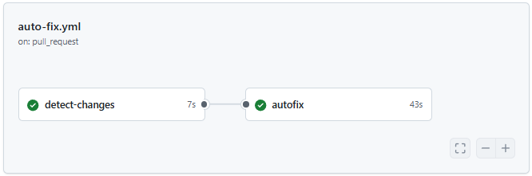
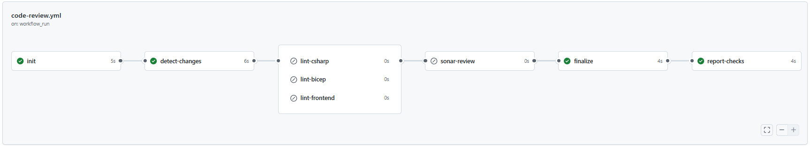

# CI/CD Pipelines – GitHub Actions

## TL;DR
Three workflows handle the full lifecycle:
1. **Auto Fix Style** (`auto-fix.yml`): Automatically formats code (C#, Bicep, JS/TS) in pull requests.
2. **Automated Code Review** (`code-review.yml`): Runs linters and SonarQube **after** Auto Fix completes.
3. **Deploy OTP** (`deploy-otp.yml`): Validates and deploys infrastructure to dev → test → prod with approval gates.

**Key points:**
- **Branch protection** requires exact check names (see below).
- `[skip ci]` in autofix commits prevents workflow loops.
- Jobs only run for relevant file types via `paths-filter`.
- Diagrams show each workflow’s structure.

---

## Workflows (overview)

| File | Purpose | Trigger |
| --- | --- | --- |
| `auto-fix.yml` | Auto-formats code (C#, Bicep, JS/TS) and commits fixes back to the PR branch. | `pull_request` (opened / synchronize / reopened) |
| `code-review.yml` | Runs language linters and SonarQube review **after** Auto Fix finished. Publishes per-stage PR checks. | `workflow_run` of **Auto Fix Style** (on `completed`) |
| `deploy-otp.yml` | Deploys OTP infrastructure (dev/test/prod) with gated approvals. | `push` to `main` |

```mermaid
flowchart TD
  %% Triggers
  A[Pull Request
  opened / synchronize / reopened] --> AF[Auto Fix Style workflow]

  %% Auto Fix
  subgraph G1["Auto Fix Style auto-fix.yml"]
    direction LR
    AF --> AF_detect[detect-changes
    paths-filter]
    AF_detect -->|C# changed| AF_cs[dotnet format OTP.sln
    + analyzers]
    AF_detect -->|Bicep changed| AF_bicep[bicep format
    infrastructure/bicep/**]
    AF_detect -->|JS/TS changed| AF_js[eslint --fix] 
    AF_cs --> AF_commit[Auto-commit autofix + skip ci]
    AF_bicep --> AF_commit
    AF_detect -->|No relevant changes| AF_skip[Skip autofix]
  end
  ---

## 1) Auto Fix Style (`auto-fix.yml`)

**Purpose**
- Detects changed file types (C#, Bicep, JS/TS).
- **C#**: Runs `dotnet format` (solution: `src/OTP/OTP.sln`) + analyzer fixes.
- **Bicep**: Runs `bicep format` in `infrastructure/bicep/`.
- **JS/TS** *(if present)*: Runs `eslint --fix`.
- Commits changes back to the PR branch with  
  `chore: apply auto-format [autofix] [skip ci]`.

**Key details**
- Skips when no relevant files changed (via `paths-filter`).
- Skips when `github.actor == 'github-actions[bot]'` to avoid infinite loops.
- `[skip ci]` prevents the workflow from triggering itself again.

**Diagram**



---

## 2) Automated Code Review (`code-review.yml`)

**Why separate**
- Runs **after** Auto Fix completes (`workflow_run`) so PR checks reflect post-format code, avoiding “fail → format → pass” flips.

**What it does**
- Finds the PR for the Auto Fix run and resolves its **current head SHA**.
- Detects changed file types.
- Runs:
  - **C#**: Restore, build, verify formatting against `.editorconfig`.
  - **Bicep**: `bicep build` and `bicep lint` under `infrastructure/bicep/**`.
  - **Frontend**: `npm ci` and `npm run lint`.
- Optionally runs **SonarQube** only if linters pass.
- Publishes per-stage PR checks + umbrella **Automated Code Review** check.

**Skip/Run logic**
- `lint-*` runs only if files of that type changed.
- `sonar-review` runs only if linters pass (can be changed to `always()`).

**Checks displayed in PR**
- `Automated Code Review / lint-csharp`
- `Automated Code Review / lint-bicep`
- `Automated Code Review / lint-frontend`
- `Automated Code Review / sonar-review`
- Umbrella: `Automated Code Review`

**Diagram**



---

## 3) Deploy OTP (`deploy-otp.yml`)

**Purpose**
- Validates Bicep templates.
- Deploys infrastructure to **dev → test → prod** sequentially.
- Uses GitHub environment protection rules for manual approvals in test and prod.

**Prerequisites**
- Azure Service Principal for each environment.
- Environment Secrets: `AZURE_CREDENTIALS` for each environment.
- Required reviewers configured for test and prod environments.

---

## Branch protection & required checks

To enforce that all checks pass before merging:

1. Go to **Settings → Branches → Branch protection rules** (or “Rulesets”).
2. Protect `main` (and optionally `develop`).
3. Enable **Require status checks to pass before merging**.
4. Add these exact required checks:

   - `Auto Fix Style / detect-changes (pull_request)`
   - `Auto Fix Style / autofix (pull_request)`
   - `Auto Fix Style / Automated Code Review (pull_request)` *(umbrella)*
   - `Auto Fix Style / Automated Code Review / lint-csharp (pull_request)`
   - `Auto Fix Style / Automated Code Review / lint-bicep (pull_request)`
   - `Auto Fix Style / Automated Code Review / lint-frontend (pull_request)`
   - `Auto Fix Style / Automated Code Review / sonar-review (pull_request)`

5. (Optional) Disable “Merge without waiting for requirements (bypass rules)” unless admin overrides are required.

---

## Local conventions
- **EditorConfig**: Formatting enforced via `.editorconfig` at the repository root.
- **Solution path**: `src/OTP/OTP.sln` (update workflows if changed).
- **Bicep path**: `infrastructure/bicep/**`.

---

## Troubleshooting
- If Auto Fix commits changes, `[skip ci]` ensures it won’t loop.
- If Code Review checks are missing:
  - Confirm Auto Fix ran and completed.
  - Verify branch protection check names match workflow outputs.
  - Check PR head SHA resolution in the `init` job logs.
